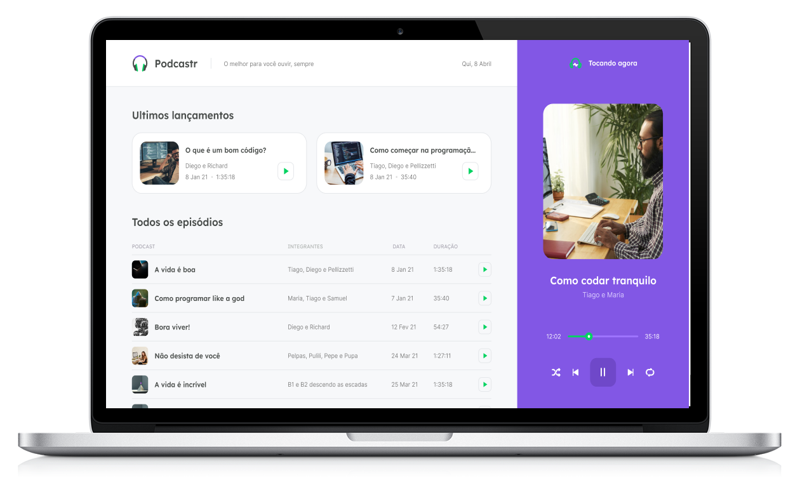

<h1 align="center">
  
</h1>

  <a href="#-tecnologias">Tecnologias</a>&nbsp;&nbsp;&nbsp;|&nbsp;&nbsp;&nbsp;
  <a href="#-projeto">Projeto</a>&nbsp;&nbsp;&nbsp;|&nbsp;&nbsp;&nbsp;
  <a href="#-como-começar">Como Começar</a>&nbsp;&nbsp;&nbsp;|&nbsp;&nbsp;&nbsp;
  <a href="#-como-contribuir">Como Contribuir</a>&nbsp;&nbsp;&nbsp;|&nbsp;&nbsp;&nbsp;
  <a href="#memo-licença">Licença</a>

 

  

 

  

## 🚀 Tecnologias

Esse projeto foi desenvolvido com as seguintes tecnologias:

- [ReactJS](https://reactjs.org/)
- [Next.js](https://nextjs.org/)
- [Sass](https://sass-lang.com/)
- [TypeScript](https://www.typescriptlang.org/)

## 💻 Projeto

O Podcastr é uma plataforma para ouvir transmissões de podcasts

## 🔥 Como Começar

- 1 - Faça um clone desse repositório `git clone https://github.com/pedroduarte2005/nlw-05-reactjs.git`;
- 2 - Entre na pasta `cd nlw-05-reactjs`;
- 3 - Rode `yarn` ou `npm install` para instalar as dependências;
- 5 - Rode a api fake: `yarn server` ou `npm run server`;
- 6 - Rode `yarn dev` ou `npm run dev` para rodar o projeto

## ⚡️ Como contribuir

- Faça um fork desse repositório;
- Cria uma branch com a sua feature: `git checkout -b minha-feature`;
- Faça commit das suas alterações: `git commit -m 'feat: Minha nova feature'`;
- Faça push para a sua branch: `git push origin minha-feature`.

Depois que o merge da sua pull request for feito, você pode deletar a sua branch.

## :memo: Licença

Esse projeto está sob a licença MIT. Veja o arquivo [LICENSE](.github/LICENSE.md) para mais detalhes.

---

Feito com ♥ by Pedro Duarte :wave:
